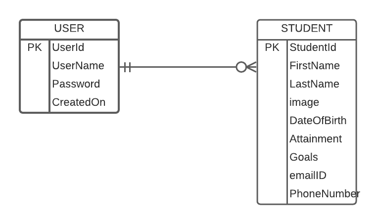

# Featured-Developers
## Project Charter:
This is the project charter for Featured Developer. This application will be developed as a progressive web application. 
## Project Purpose:
Its a web application comprise of 28 students enrolled for Graduate Direct project under Dr. Denise Case, it Determines a level of student attainments, their goals, cheers and wishes from their colleagues and instructors, this invigorate a student to achieve heights.As well as, it helps students to know acheivements of other students enrolled in their class and also get familiar with each other.This engross users to accustom.
## Team Members:
 [Amulya Baddam](https://github.com/amulyareddybaddam)   
 [Kushal Satya Durgaji Katari](https://github.com/kushalkatari)   
 [Sai vivek reddy Tadipathri](https://github.com/vivektadiparthi)   
 [Akhil Kumar Reddy Mallepally](https://github.com/akhilmallepally/)   
## Project Architecture:

### Database design:
#### Entities & Attributes:
 USERS   
 &nbsp; UserId        ->    Primary Key   
 &nbsp; UserName   
 &nbsp; Password   
 &nbsp; CreatedOn  

STUDENT 
  &nbsp; StudentId     ->    Primary Key   
  &nbsp; FirstName   
  &nbsp; LastName   
  &nbsp; image   
  &nbsp; Date   
  &nbsp; Attainment    
  &nbsp; PhoneNumber    
#### Entity-Relationship diagram:

## Functional Requirements

### Authentication page:
The authenication is only for admin, who has control over the data in the app. The authentication page must contain the following:

1. ***username***, ***password*** fields
2. A ***Captcha*** field to verify it's a real person and not a bot.
3. A ***submit*** button to validate the credentials provided by the admin.
4. If the details entered are **correct**, the page is redirected to <b>admin panel</b>.
5. If the details entered are **incorrect**, an error message is displayed stating **"Invalid credentials. Please contact the administrator"**

Roles to access the app : 
1. User
2. Admin

* User will be able to navigate through the pages and have access to all the displayed content.

* Admin will have access to create, update and delete the data along with the user privileges.
### Technology Stack:
Frontend : React.Js , Bootstrap   
Backend: NodeJS   
Database : MySQL   

### Screen Flow:
Home Screen: Consists of a header with login button, a footer and a box that displays picture of the student, all the attributes and a button that directs to the person details screen.    
Header menu screen: This screen consists a list off all the students displaying their name and picture.   
Login page: This a admin login page, from where admin gets access to add, remove or update the data.   
Person details screen: This screen displays all the details of the student.   
### Themes & Colors: 
Application carries a theme of white for the background and teal for headers, footers, buttons and menues.
### Device Support:
It is a Progressive Web Application that runs on browser as well as, native on Android and iOS.
### Development Details:
Team:
The development team for this project should comprise of a UI designer , Full Stack Engineer , Quality Analyst , Team Lead
### Font size: 
Font preference  is between 12 -14.
## Bidder Qualifications
Have the best optimized solution for the project.   
Implement functionality wiyhin time agreed at the contract.   
Must be able to communicate in person & remote, based on situation.    
Development team having a proven record in building web application is a plus.   

## Schedule Duration
| Duration | Task |
| -------- | ---- |
| 08/18/21 - 12/05/21 | Gathering requirements, designing templates, approvals. |
| 01/12/22 - 04/15/22 | Product development, Release |

### Terms and Conditions:
The entire project should be open-source and licensed under the <b>GNU General License v3.0    

